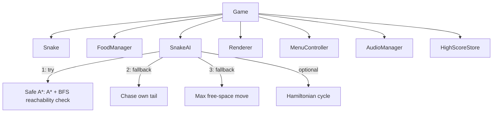

# Snake

A grid-based Snake game with an AI autopilot that plays itself using pathfinding and reachability analysis — A* to the nearest food, but only if a second search confirms the move doesn't trap the snake, falling back to tail-chasing, flood-fill survival, or an optional Hamiltonian-cycle mode that can never lose.

**Primary implementation: [`cpp/`](cpp/README.md) — modern C++ and [raylib](https://www.raylib.com/).** An earlier prototype in [`python/`](python/README.md) (pygame) is kept for reference; the two share the same core design.

## Quick start (C++)

```
cmake -B cpp/build -S cpp
cmake --build cpp/build -j
./cpp/build/snake_cpp --ai
```

See [`cpp/README.md`](cpp/README.md) for build requirements, controls, and the full architecture writeup.

## Architecture, in one diagram



`Snake`, `FoodManager`, `HighScoreStore`, and the entire AI strategy are implementation-agnostic grid logic with no rendering dependency in either version — pure enough to unit test without a display. Only `Renderer`/`MenuController`/`AudioManager` differ meaningfully between the pygame and raylib builds.

## Why two implementations

The Python version came first, as a straightforward architecture refactor + AI feature build. The C++ version is a full rewrite, not a port for its own sake: same design, same layered AI strategy, same test coverage — done in the language and toolchain (CMake, raylib, RAII resource ownership) actually relevant to real-time/game-adjacent engineering work.

## Repository Layout

```
cpp/        primary implementation — C++20, raylib, CMake, doctest
python/     earlier prototype — Python, pygame, pygame_menu, unittest
```

Each has its own README with a full architecture and technical-decisions writeup.
