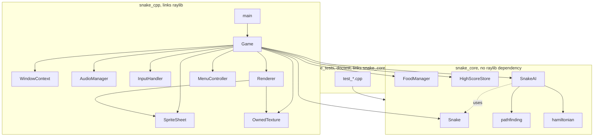

# Snake

A grid-based Snake game in modern C++ and [raylib](https://www.raylib.com/), with an AI autopilot that plays the game using pathfinding and reachability analysis instead of a fixed strategy.

## Features

- GPU-driven sprite-sheet rendering: one texture, sliced and scaled per draw call via `DrawTexturePro`, instead of pre-cropped CPU surfaces.
- A hand-rolled, keyboard-navigable menu (raylib ships no widget toolkit) for game setup and the game-over screen.
- Sound effects, score display, and a persistent all-time high score (`highscore.json`) via a vendored single-header JSON library.
- An AI autopilot (toggle with `Tab`) using A* search, a BFS reachability safety check, tail-chasing, flood-fill survival, and an optional Hamiltonian-cycle mode. See [Technical Decisions](#technical-decisions).
- A `snake_core` static library with **zero raylib dependency**: the entire simulation and AI are unit tested via [doctest](https://github.com/doctest/doctest) without a window, a GPU, or a display.

## Controls

| Action | Keys |
|---|---|
| Move | Arrow keys or `WASD` |
| Toggle AI autopilot | `Tab` |
| Toggle AI strategy (safe A* vs. Hamiltonian cycle) | `H` |
| Menu navigation | Arrows / `WASD`, `Enter` or `Space` to select |
| Quit | `Esc` or close the window |

## How to Build and Run

Requires CMake 3.16+ and a C++20 compiler. raylib is fetched and built automatically via `FetchContent`. On Linux you need the usual GL/X11 dev headers (`libgl1-mesa-dev libx11-dev libxrandr-dev libxinerama-dev libxcursor-dev libxi-dev`); Windows/macOS need nothing extra.

```
cmake -B build -S .
cmake --build build -j
./build/snake_cpp            # play
./build/snake_cpp --ai       # start with the AI already driving
```

Run the tests (pure simulation/AI logic only, no window or GPU required):

```
./build/snake_tests
```

## Architecture



`snake_core` (Cell, Direction, Snake, FoodManager, HighScoreStore, and all of `ai/`) never includes `<raylib.h>`, so `snake_tests` links against it directly with no window, texture, or audio device involved. Only `snake_cpp` links raylib; that's where `Renderer`, `AudioManager`, `InputHandler`, `MenuController`, and the RAII resource wrappers live.

```
cpp/
  CMakeLists.txt         three targets: snake_core (lib), snake_cpp (exe), snake_tests (exe)
  third_party/            vendored single-header doctest.h and json.hpp
  src/
    cell.hpp               a grid (col, row) cell + hash, no dependencies
    direction.hpp            Up/Down/Left/Right + delta/opposite helpers
    config.hpp                 grid size, timing, CellToPixel, no raylib
    snake.hpp / .cpp             body, growth, collision, the simulation
    food.hpp / .cpp                spawn/consume, avoids occupied cells
    highscore.hpp / .cpp             JSON persistence via third_party/json.hpp
    ai/
      pathfinding.hpp / .cpp         generic grid BFS / A* / flood fill
      hamiltonian.hpp / .cpp           builds a Hamiltonian cycle
      snake_ai.hpp / .cpp                the layered decision strategy
    window_context.hpp             RAII InitWindow/CloseWindow (see below)
    owned_texture.hpp               RAII LoadTexture/UnloadTexture
    sprite_sheet.hpp                 named sub-rects of one texture
    colors.hpp                        raylib Color constants
    renderer.hpp / .cpp                draws board/snake/food/HUD, no game logic
    audio_manager.hpp / .cpp             RAII sound loading, fails soft with no audio device
    input_handler.hpp / .cpp              raylib key polling -> game commands
    menu.hpp / .cpp                        hand-rolled start/game-over screens
    game.hpp / .cpp                          state machine + fixed-timestep loop
    main.cpp                                  parses --ai, builds and runs Game
  tests/                  one test_*.cpp per snake_core module, doctest
  assets/                 sprite sheet, sounds, icons (self-contained copy)
```

## Technical Decisions

### Why raylib instead of SDL2

raylib's `DrawTexturePro` takes a source rect and an arbitrarily-sized destination rect in one call, so scaling a 64x64 sprite-sheet cell to the game's 50px grid happens at draw time on the GPU. The Python/pygame version had to pre-crop and pre-scale every sprite into its own `Surface` up front, since `pygame.Surface.blit` doesn't scale.

### Construction order solves a real ownership problem

`SpriteSheet` and `OwnedTexture` call `LoadTexture`, which needs an OpenGL context that only `InitWindow` creates. C++ constructs class members in **declaration order**, regardless of a constructor's initializer-list order, so `game.hpp` declares a tiny `WindowContext` (RAII `InitWindow`/`CloseWindow`) as the *first* member of `Game`. Everything declared after it can safely assume a GL context exists.

### `snake_core` has no raylib include, on purpose

Every file under `ai/`, plus `snake.hpp`, `food.hpp`, and `highscore.hpp`, has zero rendering dependency, so `snake_tests` links and runs in milliseconds without a display. It's the same boundary the Python version drew between pygame-free logic and pygame-dependent presentation, now enforced by the build graph instead of convention.

### The AI: why A* alone isn't good enough

The obvious approach, run A* from the snake's head to the nearest apple every tick and follow it, fails because A* optimizes for *shortest path to food*, not *survives afterward*. A snake can A\*-its-way into a pocket that's the shortest route to an apple but has no exit once its own body seals the entrance.

`SnakeAI::Decide` (`src/ai/snake_ai.cpp`) layers four strategies, falling back in order:

1. **Safe A\*.** Find the A* path to the nearest food. Before committing, simulate walking the entire path, including the length increase from eating, and run a second BFS from the simulated head to the simulated tail. If the tail is still reachable, the rest of the board is provably still open, so the path is safe. If not, it's rejected even though it's the shortest one (`SafeAfter`, made public rather than private specifically so `tests/test_snake_ai.cpp` can exercise it directly against a hand-built trap grid).
2. **Tail chasing.** If no food path is safe, path toward the snake's own tail instead, since that's always reachable as a cell about to be vacated.
3. **Max-space survival.** If even that fails, take whichever legal move leaves the largest reachable area via flood fill.
4. **Hamiltonian cycle (optional, `H` to toggle).** Follow a precomputed cycle that visits every cell exactly once and returns to the start. It can never trap itself, at the cost of ignoring food and filling the board slowly. Only exists for an even `GRID_COLS * GRID_ROWS` (a real bipartite-graph constraint, not an arbitrary limitation: see the comment in `hamiltonian.hpp`).

`tests/test_snake_ai.cpp` hand-builds a 3x2 grid where the direct A* path is a dead end, and asserts `SafeAfter` rejects it and `Decide` falls back to tail-chasing instead of taking the trap: the regression test for the AI's core design claim.

### Growth timing

Eating is resolved by checking whether the *next* head cell (via `Snake::PeekNextHead()`, before `Advance()`) is food, and calling `Grow()` first if so. `Advance()` only pops the tail when there's no pending growth, so calling `Grow()` first skips that pop on the very same tick as the eat, instead of the length increase lagging a tick behind.

### Dependency management

raylib is the only dependency that needs actual compilation, so it's the only one pulled in via CMake `FetchContent` (pinned to tag `5.5`). `doctest.h` and `nlohmann/json.hpp` are vendored as single headers in `third_party/` instead, which keeps configure time down and avoids depending on those projects' own CMake option surfaces for what's just a couple of headers.

## Future Work

- Movement interpolation (animate between cells instead of snapping): the fixed-timestep loop already decouples render rate from logic rate, so this would only touch `Renderer`.
- A hybrid AI mode that takes A* shortcuts across a Hamiltonian cycle when they're provably safe, instead of treating the two as separate, mutually exclusive modes.
- Mouse support in the menu (currently keyboard-only).

## Credits

Snake spritesheet: https://opengameart.org/content/snake-sprite-sheet
